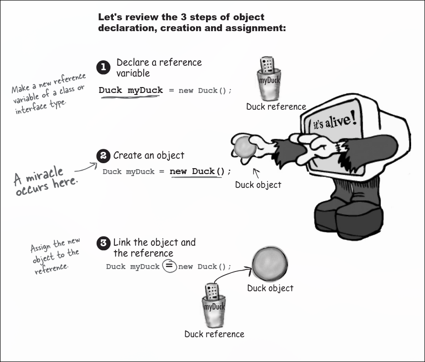

We know that all objects live on the garbage-collectible
heap,

local variables are the stack variable 
and global variable 

instance / global variable   are stored in heap 
Java makes space for the instance variables
based on the primitive type. 

Instance Variables & Memory (Java)
🔹 1. Instance Variables Live Inside Objects

All instance variables are stored inside the object (Heap)

Memory is allocated based on data type size

✔️ Primitive variables

Stored directly inside the object

Fixed size:

int → 32 bits

long → 64 bits

Value doesn’t affect memory size

2. Object Reference Variables

If an instance variable is an object:

private Antenna ant;

Java stores only the reference (address) inside the object

The actual object is NOT created automatically

When is the actual object created?
Case 1: Only declaration
private Antenna ant;

✔️ Space for reference is created (inside object)

❌ No Antenna object created in heap

Default value → null

Case 2: Object initialization
private Antenna ant = new Antenna();

✔️ Reference stored inside object

✔️ Actual Antenna object created in heap

Objects live in Heap

Object variables store references (addresses), not full objects

🔹 Inside an Object

Primitive → stored directly

Object → stored as reference only

One-Line Rule

Objects store their own data, but for other objects, they store only references.

-------------------------
|       Stack           |
|  (local variables)    |
-------------------------
|       Heap            |
|  (objects)            |
-------------------------
|  Method Area          |
|  (class metadata)     |
-------------------------

class are stored into the method areas class metadata  are stored in the 

Java has two areas of memory we care about:
the Stack and the Heap.
▪ Instance variables are variables declared
inside a class but outside any method.
▪ Local variables are variables declared inside a
method or method parameter.
▪ All local variables live on the stack, in the
frame corresponding to the method where the
variables are declared.
▪ Object reference variables work just like primi-
tive variables—if the reference is declared as a
local variable, it goes on the stack.
▪ All objects live in the heap, regardless of
whether the reference is a local or instance
variable.

If the
local variable is a reference to an object, only the
variable (the reference/remote control) goes on the
stack

Let's review the 3 steps of object
declaration, creation and assignment:

A constructor has the
code that runs when you
instantiate an object. In
other words, the code that
runs when you say new on
a class type.
Every class you write has
a constructor, even if you
don’t write it yourself

The thing
that separates a method from a construc-
tor is the return type. Methods must have a
return type, but constructors cannot have a
return type.

Are constructors inherited? If you
don’t provide a constructor but your
superclass does, do you get the superclass
constructor instead of the default?
A: Nope. Constructors are not inherited.
We’ll look at that in just a few pages.

As soon as
you provide a constructor, ANY
kind of constructor, the compiler backs off
and says, “OK fair enough, looks like you’re
in charge of constructors now.”

Overloaded constructors means you have
more than one constructor in your class.
To compile, each constructor must have adifferent argument list!

constructors and gc
you are here�249
▪ Instance variables live within the object they belong to, on
the Heap.
▪ If the instance variable is a reference to an object, both
the reference and the object it refers to are on the Heap.
▪ A constructor is the code that runs when you say new on
a class type.
▪ A constructor must have the same name as the class, and
must not have a return type.
▪ You can use a constructor to initialize the state (i.e., the
instance variables) of the object being constructed.
▪ If you don’t put a constructor in your class, the compiler
will put in a default constructor.
▪ The default constructor is always a no-arg constructor.
▪ If you put a constructor—any constructor—in your class,
the compiler will not build the default constructor.
▪ If you want a no-arg constructor and you’ve already put
in a constructor with arguments, you’ll have to build the
no-arg constructor yourself.
▪ Always provide a no-arg constructor if you can, to make it
easy for programmers to make a working object. Supply
default values.
▪ Overloaded constructors means you have more than one
constructor in your class.
▪ Overloaded constructors must have different argument
lists.
▪ You cannot have two constructors with the same
argument lists. An argument list includes the order and
type of arguments.
▪ Instance variables are assigned a default value, even
when you don’t explicitly assign one. The default values
are 0/0.0/false for primitives, and null for references.

Instance variable = object-level variable

Nanoreview: four things to
remember about constructors
1 A constructor is the code that runs when
somebody says new on a class type:
2 A constructor must have the same name
as the class, and
no return type:
3 If you don’t put a constructor in your class,
the compiler puts in a default constructor.
The default constructor is always a no-arg
constructor.
4 You can have more than one constructor in your class,
as long as the argument lists are different. Having
more than one constructor in a class means you have
overloaded constructors.
Duck d = new Duck();
public Duck(int size) { }
public Duck() { }
public Duck() { }
public Duck(int size) { }
public Duck(String name) { }
public Duck(String name, int size) { }

Java Object Lifecycle, Variables, Stack–Heap (Full Notes)
🔹 1. Object Life Depends on References

An object lives as long as at least one reference points to it

Reference alive → Object alive

No reference → Object becomes eligible for Garbage Collection (GC)

🔹 2. Variable Types & Lifetime
✔️ Local Variables

Declared inside methods

Stored in Stack

Lifetime = until method ends

Scope = only inside that method

void read() {
    int s = 42; // local variable
}

👉 After method ends → variable is destroyed

✔️ Instance Variables

Declared inside class (not static)

Stored in Heap (inside object)

Lifetime = as long as object lives

Scope = whole object

class Life {
    int size; // instance variable
}
🔹 3. Life vs Scope (VERY IMPORTANT)
✔️ Life

How long variable exists in memory

✔️ Scope

Where variable can be accessed

🔥 Key Rule

A variable can be alive but not in scope

Example Flow
void doStuff() {
    boolean b = true;
    go(4);
}

b is alive while method is on stack

But when another method runs → b is not accessible (out of scope)

🔹 4. Stack Behavior (Method Calls)

When methods call each other:

Stack:

doStuff()
go()
crazy()
Rules:

Each method → new stack frame

Top frame → currently executing

Lower frames → variables alive but not usable

🔥 Key Insight

Local variable is usable only when its method is on top of stack

🔹 5. Object vs Reference Life

Variables (references) control object life

Object lives in Heap

Reference lives in Stack (local) or Heap (instance)

🔹 6. When Object Dies (GC Eligibility)

An object becomes eligible for GC when:

✔️ 1. Reference goes out of scope
void go() {
    Life z = new Life();
} // z dies → object abandoned
✔️ 2. Reference reassigned
Life z = new Life();
z = new Life(); // first object abandoned
✔️ 3. Reference set to null
Life z = new Life();
z = null; // object abandoned
🔹 7. Garbage Collection (GC)

JVM automatically deletes unused objects

Runs when memory is low

Only deletes eligible objects

🔥 Important

If you keep references → GC cannot clean memory → risk of memory issues

🔹 8. Null Concept
A a = null;

Reference exists but points to nothing

Using it:

a.method(); // ❌ NullPointerException
🔥 Meaning

null = reference has no object (empty remote)

🔹 9. Stack Frame Destruction

When method ends:

Stack frame removed

All local variables destroyed

👉 If they were the only references → object becomes GC eligible

🔹 10. Object Creation Flow
Duck d = new Duck();
Steps:

Class loaded (Method Area)

Object created (Heap)

Reference stored (Stack)

🔹 11. Instance vs Local Variable (Core Difference)
Feature	Local Variable	Instance Variable
Location	Stack	Heap
Lifetime	Method	Object
Scope	Method only	Entire object
Default value	❌ None	✅ Yes

12. Deep Insight (VERY IMPORTANT)

Object’s life depends on references, not variables directly

Example
void barf() {
    Duck d = new Duck();
}

d dies after method

Object becomes garbage

🔹 13. Hidden Danger (Interview Level)
class A {
    B b;
}

If A is garbage → B may also become garbage
👉 Chain destruction

🔹 14. Final Mental Model
Stack → method execution + local variables
Heap → objects + instance variables
Method Area → class metadata
🔥 Ultimate Summary

Local variables live in stack and die with method.
Instance variables live in heap with object.
Objects live as long as references exist.
No reference → Garbage Collector removes object.

Java GC, Object Lifecycle & Reference Analysis (Advanced Notes)
🔹 1. Core Rule (Golden Concept)

An object is alive as long as at least one reference points to it

No reference → object becomes eligible for Garbage Collection (GC)

GC removes unreachable objects only

🔹 2. Object Death Conditions (3 Ways)
✔️ 1. Reference goes out of scope
void go() {
    GC obj = new GC();
} // obj dies → object eligible for GC
✔️ 2. Reference reassigned
GC obj = new GC();
obj = new GC(); // first object abandoned
✔️ 3. Reference set to null
GC obj = new GC();
obj = null; // object abandoned
🔹 3. GC Exercise – Key Learning

From your GC code:

🔥 Important Insights

You cannot use variables out of scope

Object dies only when last reference disappears

Even if one reference exists → object is alive

✔️ Critical Cases
Case	Result	Reason
gc2 = null;	✅ Object dead	Only reference removed
gc1 = null;	✅ Object dead	No other reference
gc4 = null;	❌ Object alive	gc3 still refers
gc3 = gc2;	❌ Object alive	another reference exists
Out-of-scope variable used	❌ Error	not accessible
🔹 4. Stack + Heap + Scope Combined

Stack → local variables (references)

Heap → objects

Method Area → class metadata

🔥 Important Rule

A reference must be alive AND in scope to be usable

🔹 5. Object Reachability Concept
✔️ Reachable object

Has at least one reference

❌ Unreachable object

No references → GC eligible

🔹 6. Popular Object Concept (Reference Counting)

From Honey example:

✔️ Most popular object = Honey object
🔥 Total References = 12
Sources:

honeyPot

Array ha → 4 references

bees.beeHoney

bears[i].hunny → 5 references

kit.honey

raccoon.rh

raccoon.rk.honey (indirect)

⚠️ Important Insight
kit = null;

❌ Does NOT destroy Honey object

Because:

raccoon.rk → kit → honey

👉 Object still reachable indirectly

🔹 7. Indirect References (VERY IMPORTANT)

Object can survive through reference chains

Example:

raccoon.rk.honey

Even if:

kit = null;

👉 Object still alive

🔹 8. Null Behavior
ref = null;

Reference removed

Object may die only if no other references exist

⚠️ Danger
ref.method(); // ❌ NullPointerException
🔹 9. Constructor Side Effects (Hidden Bug)

From Five-Minute Mystery:

🔥 Problem
class V3Radiator extends V2Radiator {
    V3Radiator(ArrayList list) {
        super(list); // calls V2 constructor
    }
}

👉 Every V3Radiator:

ALSO creates 5 V2 objects

✔️ Result

Expected power: 100

Actual power: 120

🔥 Key Concept

Constructor chaining can create hidden extra objects

🔹 10. Debugging Strategy

✔️ Add logging in constructor:

SimUnit(String type) {
    System.out.println("Created: " + type);
}

👉 Helps detect unexpected object creation

🔹 11. Power Calculation Logic
int powerUse() {
    if ("Retention") → 2
    else → 4
}
✔️ Bug Insight

Extra V2 objects → extra power consumption
👉 Wrong simulation results

🔹 12. Object Dependency Chain (Advanced)

If parent object dies → child objects may also become unreachable

Example:

Dog → Collar → Buckle

If:

Dog = null;

👉 Entire chain may be GC eligible

🔹 13. Final Mental Model
Reference → controls object life
Object → lives in heap
Stack → holds references
No reference → object dies
🔥 Ultimate Summary

Object life = reference life

Local variables die with method

Instance variables live with object

GC removes unreachable objects

Indirect references keep objects alive

Constructor chaining can create hidden objects

⚡ Ultra Short Revision

Object alive → at least 1 reference

No reference → GC

null / reassignment / scope → kill reference

Chains keep objects alive

Constructors can create hidden objects

If you want next:

I can give you a step-by-step GC dry run (like exam solving)

Or a set of tricky GC problems (very high-level interview style)

